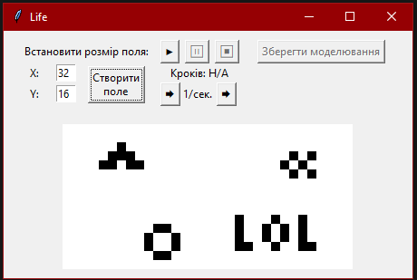
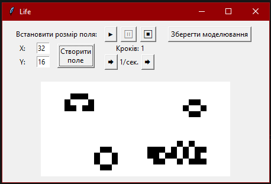
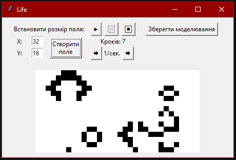
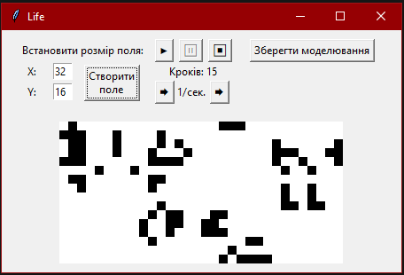

# Graphical Visualization of Conway's Game of Life

## Project Description

This project is a graphical visualization of Conway's Game of Life. The Game of Life is a cellular automaton created by the English mathematician John Conway in 1970. This project was developed as part of a university coursework and now serves as a pet project.

## Rules of the Game of Life

The game consists of a grid of cells, each of which can be alive or dead. Each cell interacts with its eight neighbors (horizontal, vertical, or diagonal). In each subsequent iteration, the state of a cell changes according to the following rules:

1. A live cell with fewer than two live neighbors dies (underpopulation).
2. A live cell with two or three live neighbors remains alive (ideal population).
3. A live cell with more than three live neighbors dies (overpopulation).
4. A dead cell with exactly three live neighbors becomes alive (reproduction).

# Графічна візуалізація гри «Життя» Джона Конвея

## Опис проекту

Цей проект є графічною візуалізацією гри «Життя» (англ. Conway's Game of Life). Гра «Життя» є клітковим автоматом, який був створений англійським математиком Джоном Конвеєм у 1970 році.

## Правила гри «Життя»

Гра складається з сітки клітин, кожна з яких може бути живою або мертвою. Кожна клітина взаємодіє з восьми сусідами (горизонтально, вертикально або діагонально). У кожній наступній ітерації, стан клітини змінюється за наступними правилами:

1. Жива клітина з менш ніж двома живими сусідами вмирає (недостатня кількість населення).
2. Жива клітина з двома або трьома живими сусідами залишається живою (ідеальна кількість населення).
3. Жива клітина з більш ніж трьома живими сусідами вмирає (перенаселення).
4. Мертва клітина з рівно трьома живими сусідами стає живою (відродження).

# Images

